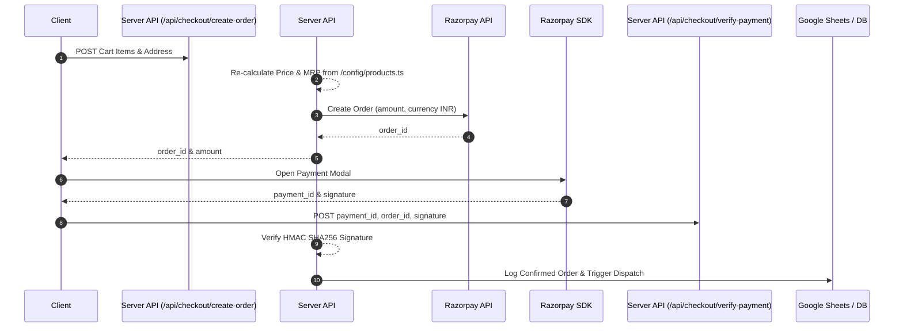

# GLOW VAI Checkout & Payment Integration Plan

## Overview
This document outlines the architecture for connecting the cart system (`/lib/store/cart.ts`) to a payment gateway such as **Razorpay** or **Stripe India**.

## Server-Side Order Verification Flow

## Security & Integrity Rules
1. **Never Trust Client Prices**: The browser sends product IDs and quantities only. The server re-fetches prices from `/lib/catalog.ts` before creating the order.
2. **HMAC Signature Verification**: Payment callbacks verify the `razorpay_signature` header using `RAZORPAY_SECRET` before marking an order as paid.
3. **Webhook Handling**: Implement `/api/webhooks/razorpay` with raw body signature verification to handle asynchronous payment confirmations.
4. **GST Invoice Compliance**: Output invoices containing HSN codes, SGST/CGST breakdown, and registered GSTIN number.
